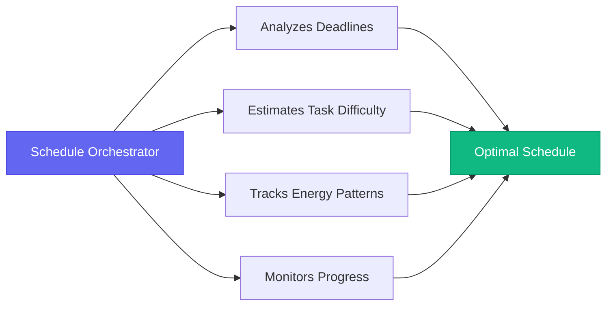
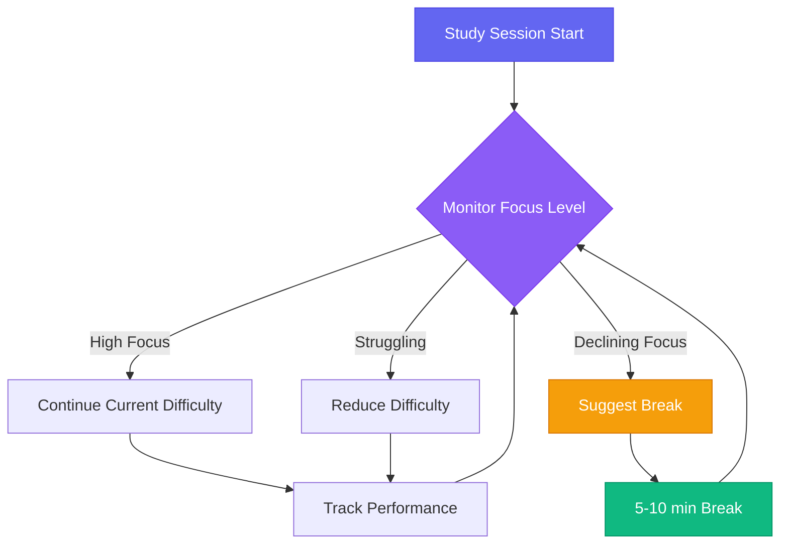
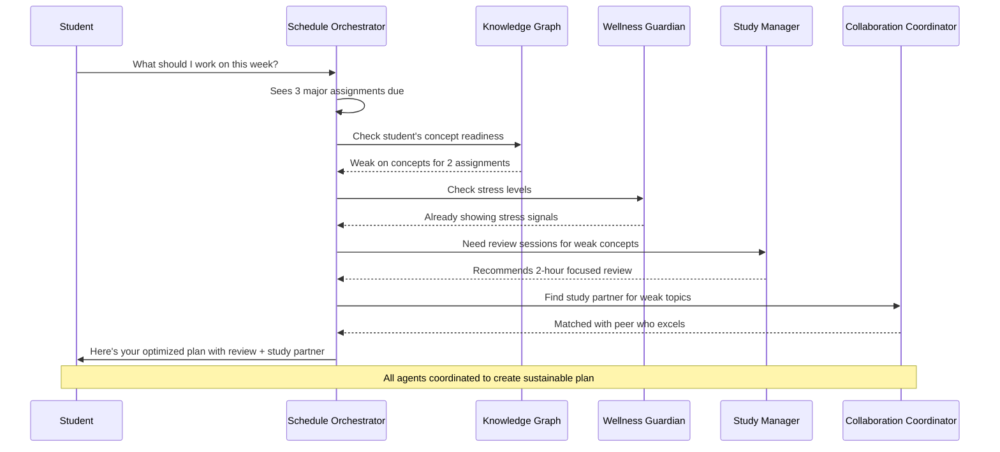

## From Tools to Teammates

When I started working on Quasera, I had a simple insight: **what if students had access to a team of specialized experts**, each focused on a different aspect of academic success, all working together 24/7?

That is the promise of multi-agent AI systems. Instead of one generalized AI trying to do everything, you have multiple specialized agents, each excellent at one thing, all coordinating to support your learning.

 

Think about how a successful student actually operates. They do not just study. They:

- Plan and prioritize tasks
- Track deadlines and commitments
- Organize materials across courses
- Quiz themselves for retention
- Collaborate with peers
- Manage their energy and well-being
- Constantly adjust their approach based on what is working

**That is a lot of mental overhead.** Now imagine delegating each of these functions to a dedicated AI agent that is always on, always learning your patterns, always optimizing.

 
 

## The Agent Team

Let me paint a picture of what this looks like in practice. Here are some of the specialized agents we are building into Quasera:

 

### The Schedule Orchestrator

This agent understands the complex puzzle of academic scheduling. It knows your deadlines, the difficulty of each assignment, your past performance patterns, and even your energy levels at different times of day.

 

 

It does not just create a static schedule. It **continuously reoptimizes** based on changing circumstances:

- Assignment deadline moved up? → Automatically reshuffles your week
- Feeling burned out? → Suggests lighter work during recovery periods
- Ahead of schedule? → Recommends advanced preparation for upcoming topics

The goal is to eliminate the constant mental math of figuring out what to work on next.

 

### The Knowledge Graph Builder

This agent maps your understanding of concepts across all your courses. It tracks which concepts you have mastered, which need review, and which prerequisites you might be missing.

 

When you struggle with a new topic, it can identify the root cause:

| Symptom | Root Cause Identified | Intervention |
|---------|----------------------|--------------|
| Struggling with calculus integrals | Missing derivative fundamentals | Targeted review of derivatives |
| Confused by organic chemistry | Weak understanding of electron configuration | Chemistry basics refresher |
| Can't solve recursion problems | Unclear on function call stack | Interactive recursion visualization |

 

The agent provides **targeted interventions** rather than generic "review everything" advice.

 

### The Study Session Manager

This agent focuses on optimizing how you actually study. It generates personalized practice problems, creates adaptive quizzes, and suggests the most effective study strategies based on your learning style and the subject matter.

 

It also tracks your **cognitive load** during study sessions:

 

Suggesting breaks before you burn out and adjusting difficulty to keep you in the optimal challenge zone.

 

### The Collaboration Coordinator

Learning is social, but finding the right study partners is hard. This agent matches you with peers based on:

- Compatible schedules
- Complementary strengths (you excel in topic A, they excel in topic B)
- Shared courses and interests
- Similar learning pace

 

It facilitates study group formation, suggests collaborative activities, and even helps coordinate group projects by tracking contributions and keeping everyone accountable.

 

### The Wellness Guardian

Academic success requires mental and physical health. This agent monitors stress signals, tracks sleep patterns, and detects early signs of burnout.

 

> **Early Warning System:** When it identifies concerning patterns, it suggests interventions before crisis hits—scheduling breaks, adjusting workload, connecting you with campus resources.

The goal is **preventing crises, not just reacting to them**.

 
 

## How They Work Together

The real power comes from coordination. These agents share information and make joint decisions.

 

**Example Scenario: Sunday Evening, Heavy Week Ahead**

 

**The Result:** You get one integrated recommendation, but it is informed by multiple specialized intelligences working together.

 
 

## The Technology Behind It

Building this requires advances across multiple AI domains:

 

| Technology | Purpose | Challenge |
|-----------|---------|-----------|
| **Natural Language Processing** | Understand your questions and context | Handle casual, ambiguous phrasing |
| **Knowledge Representation** | Model complex concept relationships | Scale across all academic domains |
| **Predictive Modeling** | Forecast performance and risks | Ensure accuracy without bias |
| **Multi-Agent Coordination** | Seamless agent collaboration | Prevent conflicts and redundancy |

 

The challenge is making this complexity **invisible to the user**. The system should feel simple and intuitive, even though it is doing sophisticated reasoning behind the scenes.

 
 

## Why Now?

This vision has been theoretically possible for years. What has changed is the maturity of **large language models** and advances in **agent architectures**.

 

Modern AI models can:

- ✓ Understand context and nuance
- ✓ Reason about complex scenarios
- ✓ Communicate naturally
- ✓ Be specialized while maintaining general capabilities

 

Equally important, we now have practical experience with AI agent systems from domains like software development and business automation. **We can apply those lessons to education.**

 
 

## What This Means for Students

If we execute well, students using Quasera will experience several fundamental shifts:

 

**From Overwhelmed to Supported**

Instead of drowning in a sea of disconnected tools and responsibilities, you have a coordinated support system.

 

**From Reactive to Proactive**

Instead of constantly playing catch-up, you get early warnings and preventive interventions.

 

**From Generic to Personalized**

Instead of one-size-fits-all advice, you get recommendations tailored to your specific situation, learning style, and goals.

 

**From Isolated to Connected**

Instead of struggling alone, you are automatically connected with helpful resources and peers.

 

> **The Goal:** Not to automate learning, but to eliminate the overhead and friction that distracts from actual learning.

 
 

## The Challenges Ahead

I want to be honest about the difficulties. **Building truly intelligent, helpful AI agents is hard.**

 

### Technical Challenges

- Making agents that are reliable across diverse scenarios
- Coordinating multiple systems without conflicts
- Handling edge cases gracefully
- Maintaining performance at scale

 

### Design Challenges

- Creating interfaces that expose the right information without overwhelming users
- Building trust through transparency
- Respecting user autonomy while providing guidance
- Balancing automation with human control

 

### Ethical Challenges

- Ensuring academic integrity
- Protecting student privacy
- Avoiding over-reliance on AI assistance
- Preventing bias in recommendations

 

We are tackling these systematically, but they require **ongoing attention and iteration** based on real-world use.

 
 

## Looking Forward

We are still in the early stages of this journey. The full agent ecosystem will take time to build and refine. But the foundation is solid, and each new capability makes the system more powerful.

 

I believe multi-agent AI systems represent the future of educational technology. Not because they are flashy or trendy, but because they **match how learning actually works**: as a complex, multifaceted process requiring different types of support at different times.

The question is not whether this will happen, but **how thoughtfully it will be designed**. At Orbythic, we are committed to building these systems the right way: respecting learners, enhancing rather than replacing human judgment, and keeping genuine learning at the center.

 

---

 

Interested in experiencing the future of AI-powered learning? [Join the Quasera early access program](/pricing) to help shape the platform as we build it.
