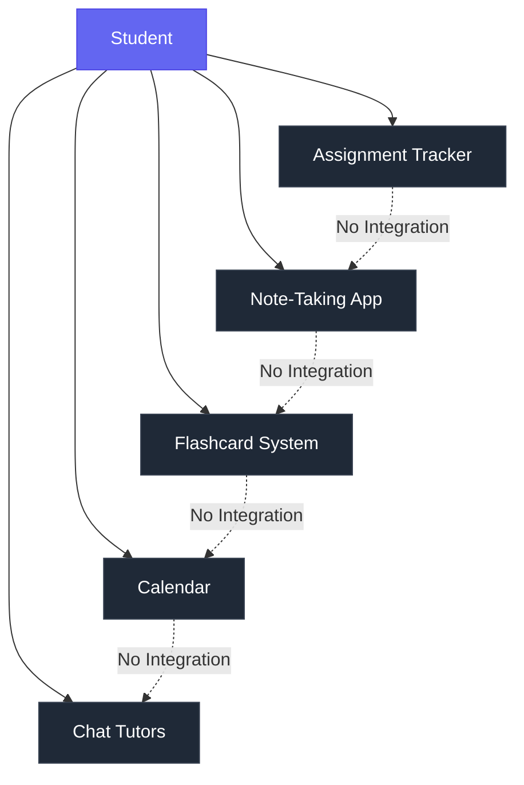
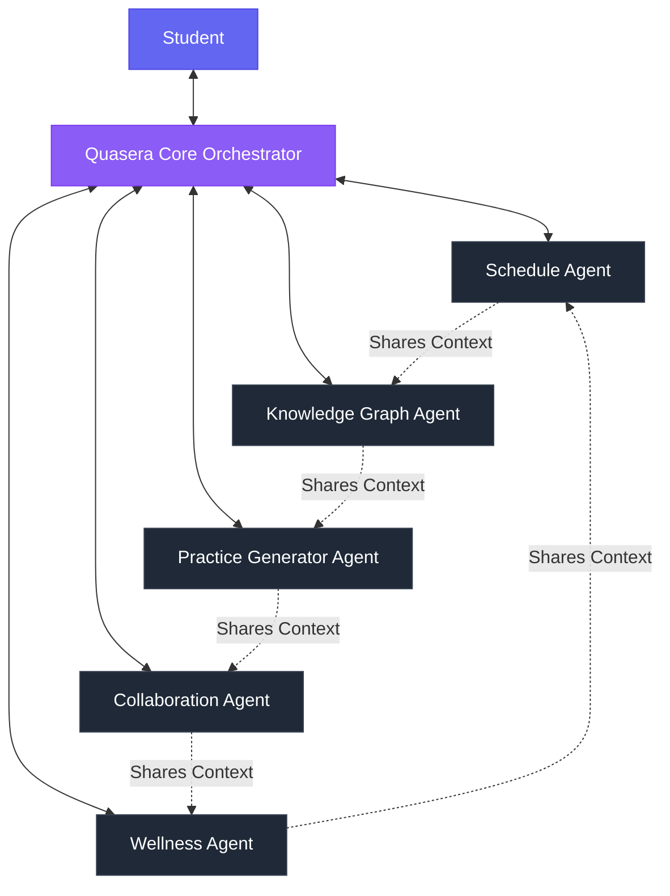
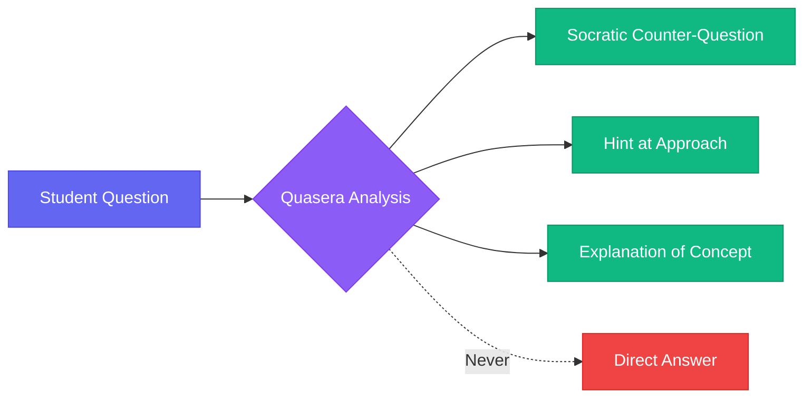

## The Problem With Learning Tools Today

As a student, I have experienced firsthand how fragmented the modern learning experience has become. We juggle a dozen different tools: one for assignments, another for notes, a third for flashcards, and yet another for time management. Each tool operates in isolation, unaware of the bigger picture of our academic journey.

More frustratingly, these tools are **reactive, not proactive**. They wait for us to remember to use them, to manually input data, to make connections between concepts across different courses. In an age where AI can drive cars and write code, why are our learning tools stuck in the past?

 

### The Current Learning Tool Landscape

> **The Core Problem:** Each tool operates in a silo, creating cognitive overhead as students manually coordinate between them.

 
 

## A Different Approach: The AI Learning Ecosystem

At Orbythic, we are building Quasera not as another study app, but as a **comprehensive AI-powered learning ecosystem**. Think of it as an academic operating system that understands your entire educational journey and actively works to optimize it.

The vision is built on three core principles:

 

### 1. Holistic Understanding

Quasera does not just track individual assignments or flashcard decks. It builds a complete understanding of your academic life:

- Your courses and curriculum
- Your learning patterns and preferences
- Your strengths and weaknesses
- Your upcoming deadlines and priorities
- Your energy levels throughout the day

 

This holistic view allows the system to make intelligent decisions that single-purpose tools cannot:

- Recognize when you are overloaded and suggest schedule adjustments
- Identify knowledge gaps before they become problems
- Connect concepts across different courses that you might not see yourself
- Balance workload distribution to prevent burnout

 

### 2. Proactive Intelligence

Traditional tools are passive. Quasera is proactive.

| Traditional Tools | Quasera |
|------------------|---------|
| Wait for you to open them | Sends timely notifications |
| Require manual data entry | Learns from your behavior |
| React to problems after they occur | Predicts and prevents issues |
| Track completion | Understand mastery |

 

Instead of waiting for you to remember to review material, it predicts when you are likely to forget and schedules review sessions. Instead of letting you fall behind, it detects early warning signs and intervenes before problems compound.

This shift from reactive to proactive is fundamental. **The system becomes a partner in your education**, not just a tool you have to remember to use.

 

### 3. Multi-Agent Architecture

The secret to achieving this level of intelligence is a **multi-agent AI architecture**. Rather than a single monolithic AI trying to do everything, Quasera orchestrates multiple specialized AI agents, each focused on a specific aspect of learning:

 

**Agent Responsibilities:**

- **Schedule Agent:** Optimizes your schedule based on deadlines, difficulty, and your energy patterns
- **Knowledge Graph Agent:** Tracks concept mastery and identifies gaps across all courses
- **Practice Generator:** Creates personalized practice problems at optimal difficulty
- **Collaboration Agent:** Facilitates study groups and peer learning opportunities
- **Wellness Agent:** Monitors your well-being and prevents burnout

These agents work together, sharing information and coordinating actions to provide a seamless, intelligent experience.

 
 

## Why This Matters

Education is at an inflection point. The traditional model of one-size-fits-all instruction is breaking down. Students need personalized support, but human tutors and advisors cannot scale to provide 24/7 assistance to millions of learners.

 

AI-powered learning systems can bridge this gap, but only if they are designed thoughtfully:

- ✓ **Enhance learning** without enabling shortcuts
- ✓ **Respect academic integrity** while providing powerful assistance
- ✓ **Adapt to individual needs** while maintaining educational rigor

These are the challenges we are tackling with Quasera.

 
 

## The Road Ahead

We are currently in the early stages of bringing this vision to life. The architecture is ambitious: we are building systems for adaptive scheduling, knowledge graph intelligence, conversational AI with memory, collaborative learning networks, and much more.

 

### The Technical Challenges

Building AI agents that truly understand learning requires advances in:

1. **Natural Language Processing** - Understanding student questions and context
2. **Knowledge Representation** - Modeling complex concept relationships
3. **Predictive Modeling** - Forecasting performance and identifying risks
4. **Human-Computer Interaction** - Creating intuitive interfaces for complex systems

 

Creating a system that feels intuitive while handling complex coordination behind the scenes demands careful design. But the potential impact makes it worthwhile.

If we succeed, we can **democratize access to personalized, adaptive learning support**. We can help students not just survive their education, but thrive in it.

 
 

## Academic Integrity By Design

One concern I want to address directly: how do we ensure Quasera enhances learning rather than enabling shortcuts?

 

**Academic integrity is not an afterthought for us. It is built into the core architecture.**

The system is designed to guide learning, not provide answers:

- Uses **Socratic questioning** to develop understanding
- Provides **hints and explanations** rather than direct solutions
- Maintains **complete audit trails** of all interactions
- Focuses on **concept mastery** through multiple evidence points over time

 

 

Most importantly, it focuses on developing **genuine understanding**, not just completing assignments. The system measures concept mastery through multiple evidence points over time, not just whether an assignment was submitted.

 
 

## Join Us on This Journey

We are building Quasera in the open, sharing our progress and learning as we go. If you are interested in AI-powered education, learning science, or the future of how we learn, I invite you to follow along.

Sign up for early access on our website, and you will get updates as we reach major milestones. Your feedback during the development process will help shape what Quasera becomes.

**The future of learning should be intelligent, adaptive, and deeply personal. That is what we are building.**

 

---

 

Want to stay updated on Quasera's development? [Join our early access waitlist](/pricing) to be among the first to experience the future of AI-powered learning.
