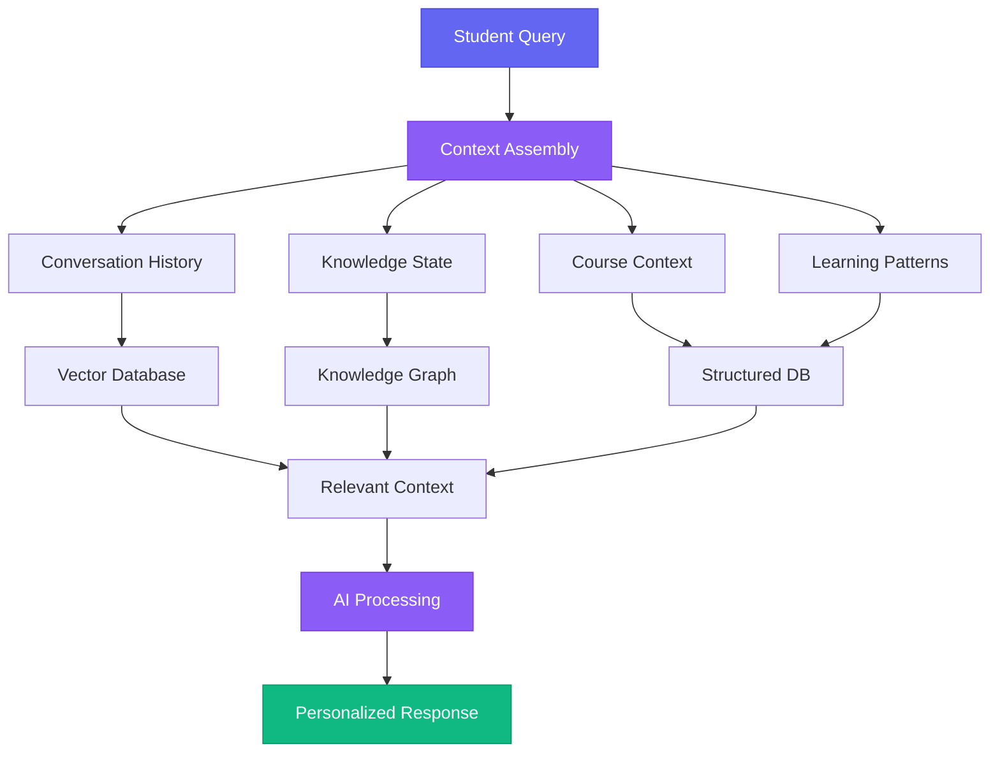
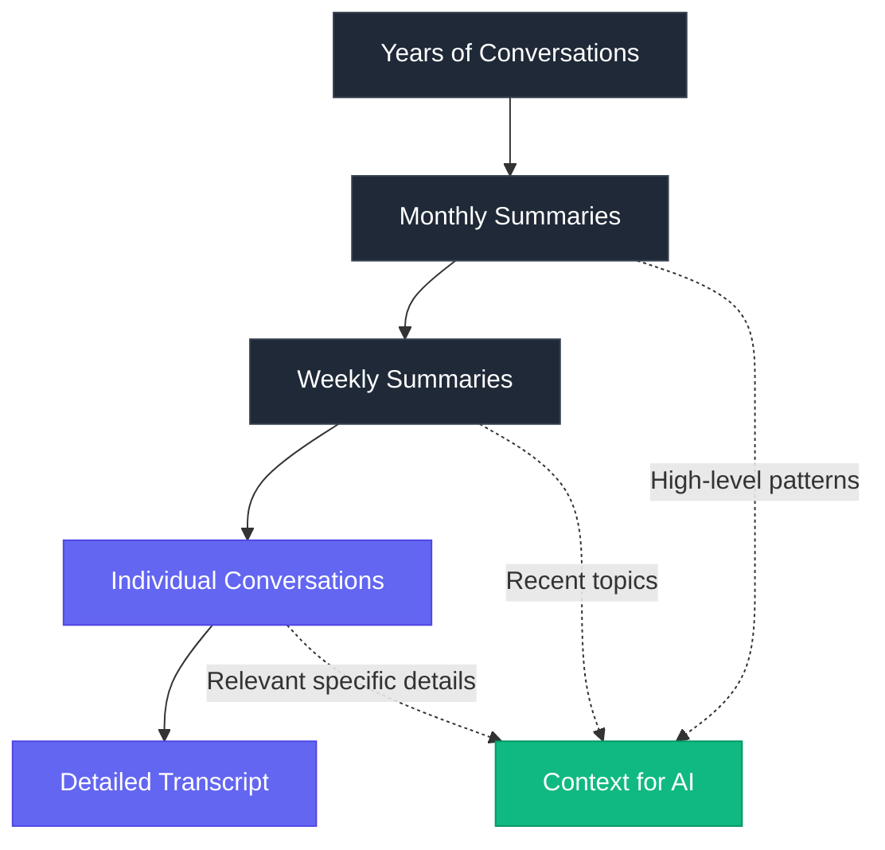
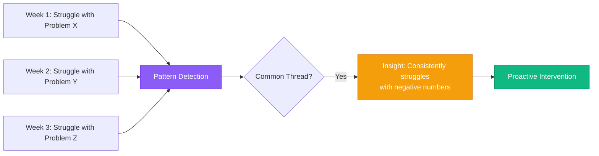

## The Forgetting Problem

Have you ever used a chatbot for customer support and had to explain your entire situation from scratch every single time you reconnect? Frustrating, right?

Now imagine using that same forgetful system as a learning companion. Every conversation starts from zero. It does not remember what you struggled with last week. It does not know which concepts you have already mastered. It cannot build on previous explanations or reference earlier breakthroughs.

 

**That is the state of most AI tutoring systems today.** They are powerful in the moment but have no memory, no continuity, no understanding of your learning journey over time.

For Quasera, we knew memory and context had to be core features, not afterthoughts.

 
 

## What Makes Memory Different

When we talk about memory in AI systems, we mean several distinct capabilities:

 

### Conversational Memory

The system remembers what you discussed. Not just vague topics, but specific questions, explanations that worked, analogies that clicked, and points of confusion that required multiple attempts to clarify.

 

This allows for natural continuation:

> "I am still confused about that calculus concept we discussed"
>
> → System instantly recalls the previous conversation and builds on it

 

### Knowledge State Tracking

Beyond conversations, the system tracks **what you actually know**:

- Which concepts have you demonstrated mastery of?
- Which are you still learning?
- Which do you need to review?

 

This knowledge state evolves based on multiple signals:

| Signal Type | Example | Impact on Knowledge State |
|------------|---------|--------------------------|
| Quiz Performance | 90% on derivatives quiz | Mark derivatives as mastered |
| Explanation Quality | Correctly explained concept to peer | Confirm deep understanding |
| Time Decay | Last practiced 3 weeks ago | Flag for review |
| Error Patterns | Consistently confuses concepts A & B | Identify specific misconception |

 

### Contextual Awareness

The system knows the broader context of your academic life:

- What courses you are taking
- Upcoming deadlines and priorities
- Recent assignments and performance
- Materials you have uploaded
- Current learning goals

 

This context shapes every interaction. When you ask about neural networks, the system knows whether you are learning them for a computer science course, a biology class, or personal interest, and adjusts its explanation accordingly.

 

### Pattern Recognition

Over time, the system learns your patterns:

- When you study best (morning vs evening)
- What types of explanations resonate (visual vs analytical)
- Which study strategies work for you
- How you respond to different levels of challenge

**These patterns enable personalization that goes far deeper than simple preferences.**

 
 

## The Technical Architecture

Building this required solving several hard problems:

 

### System Architecture Overview

 

### Persistent Storage with Fast Retrieval

Every conversation, every interaction, every learning signal must be stored. But storage alone is not enough. **The system must retrieve relevant information instantly** during conversations.

 

We use a hybrid approach:

- **Structured Databases** for factual information (courses, deadlines, scores)
- **Vector Databases** for semantic search (find similar past conversations)

This allows the system to find relevant past conversations even when you phrase things differently.

 

### Intelligent Summarization

You cannot feed years of conversation history into every AI query. The system must intelligently summarize long interactions into key points while retaining critical details.

 

**Hierarchical Summarization Strategy:**

 

The system maintains both **granular detail** and **high-level narrative**.

 

### Context Building

Before responding to any query, the system assembles relevant context from multiple sources:

1. Conversation history
2. Knowledge state
3. Uploaded materials
4. Current assignments
5. Recent struggles

 

This context assembly happens in **milliseconds** and is optimized to include the most relevant information without exceeding the AI model's context window.

 

### Privacy and Security

Storing detailed learning data raises important privacy questions. We implement strict security measures:

- **Encryption** at rest and in transit
- **Granular access controls** - you decide who sees what
- **Clear data ownership** - you own your data completely
- **Export/delete capabilities** - take your data or remove it anytime

 

> **Core Principle:** We never sell data or use it for purposes beyond improving your learning experience.

 
 

## How This Transforms Learning

Memory and context enable several powerful capabilities:

 

### Building on Prior Knowledge

Instead of explaining from first principles every time, the system can reference past understanding:

> **Without Memory:** "Let me explain integration from scratch..."
>
> **With Memory:** "Remember when we talked about derivatives? Integration is essentially the reverse operation."

 

This creates **continuity** and helps you build a coherent knowledge structure rather than disconnected facts.

 

### Detecting Patterns You Miss

The system can notice patterns you might not see:

 

> "You consistently struggle with problems involving negative numbers. Let's review that concept."

These insights come from analyzing your work across weeks or months, something difficult to do manually.

 

### Personalized Explanations

By remembering which types of explanations worked before, the system adapts its teaching style:

| Learning Style Detected | Future Approach |
|------------------------|-----------------|
| Visual diagrams clicked for physics | Lead with diagrams for chemistry |
| Step-by-step walkthrough worked for algebra | Use detailed procedures for calculus |
| Real-world examples helped with economics | Connect theory to practical scenarios |

 

### Proactive Support

With context about upcoming deadlines and your mastery levels, the system can proactively suggest review:

> "You have that organic chemistry exam in 3 days. Based on your last quiz, I recommend reviewing reaction mechanisms."

 

### Long-term Learning Narratives

The system can show you your progress over time, highlighting growth and areas of persistent difficulty. This **metacognitive awareness** is valuable for self-directed learning.

 
 

## The Implementation Challenge

Building this is technically complex. It requires:

 

1. **Efficient Database Design** - High-speed retrieval of relevant memories from massive datasets
2. **Sophisticated NLP** - Understanding queries in context, not just literal meaning
3. **Machine Learning Models** - Pattern detection and performance prediction
4. **Careful Prompt Engineering** - Incorporate context without overwhelming the AI
5. **Robust Testing** - Ensure memory accuracy and relevance across scenarios

 

But the investment is worth it. **The difference between a contextual, memory-enabled AI tutor and a stateless chatbot is dramatic.**

 
 

## What This Means for Students

Imagine having a tutor who:

- ✓ Remembers every concept you have struggled with
- ✓ Knows your upcoming deadlines and current workload
- ✓ Understands which teaching approaches work for you
- ✓ Can reference specific past conversations and materials
- ✓ Builds on previous explanations rather than starting from scratch
- ✓ Proactively suggests review before you forget material

 

**That is what memory and context enable.** It transforms AI from a one-off question-answering tool into a genuine learning companion.

 
 

## Looking Ahead

We are continually improving these capabilities. Future enhancements include:

 

- **Cross-course concept linking** to identify knowledge transfer opportunities
- **Emotional state tracking** to adjust support based on stress and confidence levels
- **Collaborative memory** that learns from similar students while respecting privacy
- **Learning science integration** to optimize review timing and strategy

 

The goal is an AI companion that understands **not just what you know, but how you learn**, and uses that understanding to accelerate your growth.

 
 

## Building in the Open

As we develop these systems, we are committed to transparency about how they work, what data they collect, and how they use it.

Students deserve to understand the AI systems supporting their education. We believe memory and context are essential features, but they must be implemented thoughtfully with **privacy and agency at the forefront**.

 

---

 

Want to experience the difference memory-enabled AI makes? [Join our early access waitlist](/pricing) for Quasera and help us build the future of intelligent tutoring.
